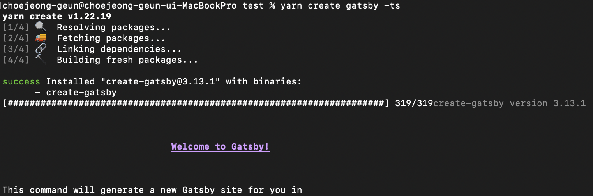
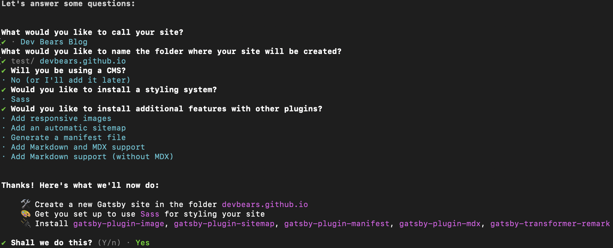
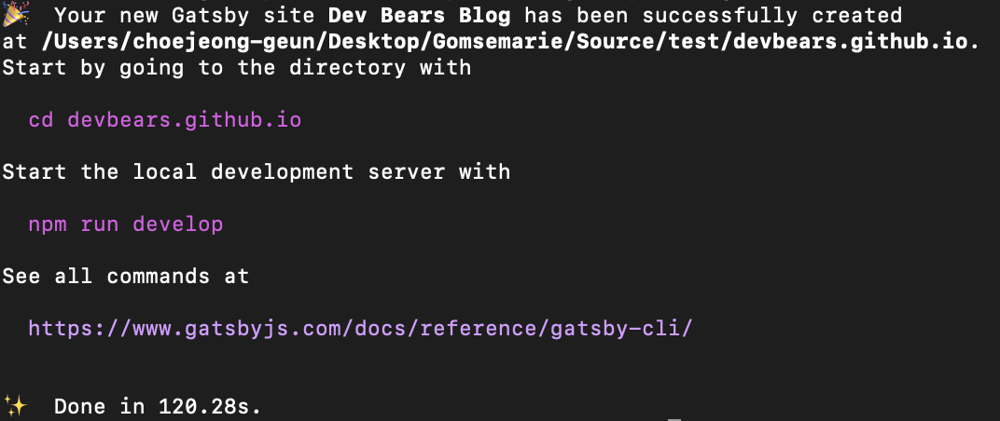

import GATSBY_SETTING_01 from "./images/gatsby-setting-01.png";
import Gist from "react-gist";

# 타이틀 테스트

## Gatsby 프로젝트 생성

개발자라면 역시 맥북을 사용하고 있을것이라 믿고 MacOS 기준으로 알려드립니다.

### H3 테스트1

---

### H3 테스트2

---

### H4 테스트3

1. Gatsby 프로젝트를 생성할 폴더로 이동해 줍니다.
2. `터미널`을 열어 _yarn create gatsby -ts_ 명령어를 사용해줍니다.

```bash
yarn create gatsby -ts
```

{/*  */}



3. 필요한 정보를 순서대로 입력해 줍니다



4. 정상적으로 세팅이 완료되었는지 `Done` 메세지를 확인합니다.



## Gatsby Markdown 꾸미기

Markdown 플러그인들을 추가하여 블로그 내용을 꾸며봅시다.

```tsx
import { useInsertionEffect } from "react";

// 컴포넌트
function MyButton() {
  function useCSS(rule) {
    useInsertionEffect(() => {
      // ... <style> 태그를 여기에서 주입하세요 ...
    });
    return rule;
  }

  const className = useCSS("...");
  return <div className={className} />;
}
```

<Tip title="타이틀 입니다">`sdsd` 무요 누구요!</Tip>

<Gist id="5c803d1d0c7039ef1ade67a0fdc80ed6" file="main.go"></Gist>

> 인용 테스트 입니다.

> 인요요용
